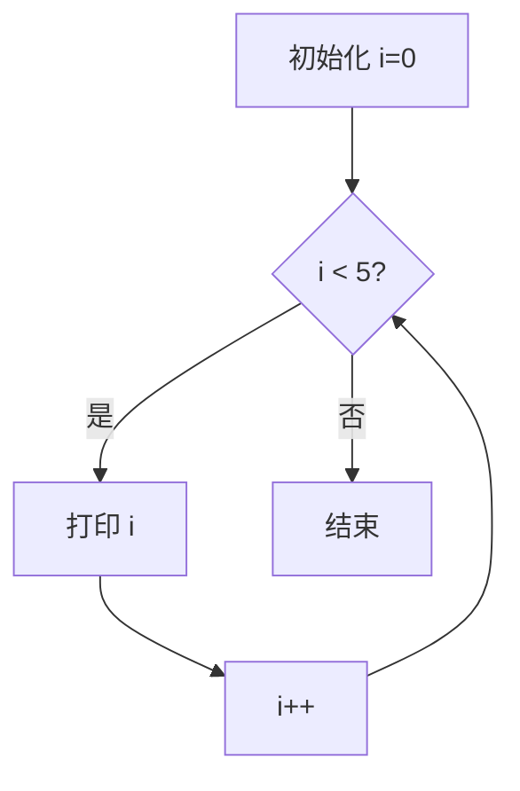
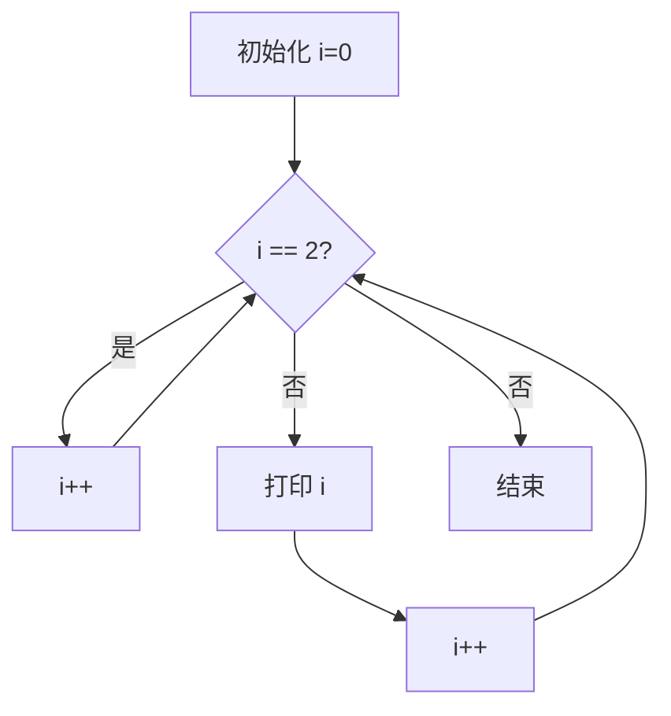
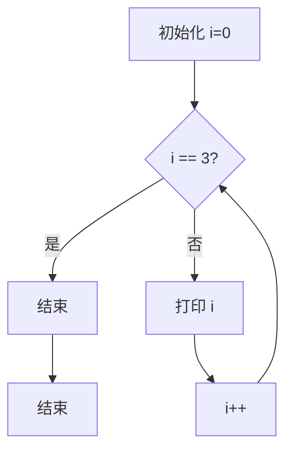

# `while` 循环

`while` 循环用于在给定条件为真时重复执行一段代码。其基本语法如下：

```c
while (条件) {
    // 循环体
}
```

**示例：**

```c
int i = 0;
while (i < 5) {
    printf("%d\n", i);
    i++;
}
```

**流程图：**



# `for` 循环

`for` 循环用于在已知循环次数的情况下重复执行一段代码。其基本语法如下：

```c
for (初始化; 条件; 更新) {
    // 循环体
}
```

**示例：**

```c
for (int i = 0; i < 5; i++) {
    printf("%d\n", i);
}
```

**流程图：**


# `continue` 语句

`continue` 语句用于跳过当前循环的剩余部分，直接进入下一次循环的条件判断。它通常用于在满足特定条件时跳过当前循环的其余部分。

**示例：**

```c
for (int i = 0; i < 5; i++) {
    if (i == 2) {
        continue;
    }
    printf("%d\n", i);
}
```

**流程图：**



# `break` 语句

`break` 语句用于立即终止当前循环或 `switch` 语句的执行，跳出循环或 `switch` 结构。

**示例：**

```c
for (int i = 0; i < 5; i++) {
    if (i == 3) {
        break;
    }
    printf("%d\n", i);
}
```

**流程图：**



# `switch` 语句

`switch` 语句用于根据不同的条件执行不同的代码块。其基本语法如下：

```c
switch (表达式) {
    case 常量1:
        // 代码块1
        break;
    case 常量2:
        // 代码块2
        break;
    // ...
    default:
        // 默认代码块
}
```

**示例：**

```c
int day = 3;
switch (day) {
    case 1:
        printf("星期一\n");
        break;
    case 2:
        printf("星期二\n");
        break;
    case 3:
        printf("星期三\n");
        break;
    default:
        printf("无效的日期\n");
}
```

**流程图：**

```mermaid
graph TD
    A[获取 day] --> B{day == 1?}
    B -- 是 --> C[打印 "星期一"]
    B -- 否 --> D{day == 2?}
    D -- 是 --> E[打印 "星期二"]
    D -- 否 --> F{day == 3?}
    F -- 是 --> G[打印 "星期三"]
    F -- 否 --> H[打印 "无效的日期"]
    C --> I[结束]
    E --> I
    G --> I
    H --> I
    ```
